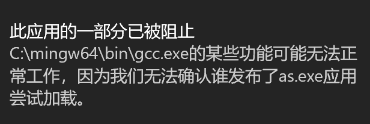
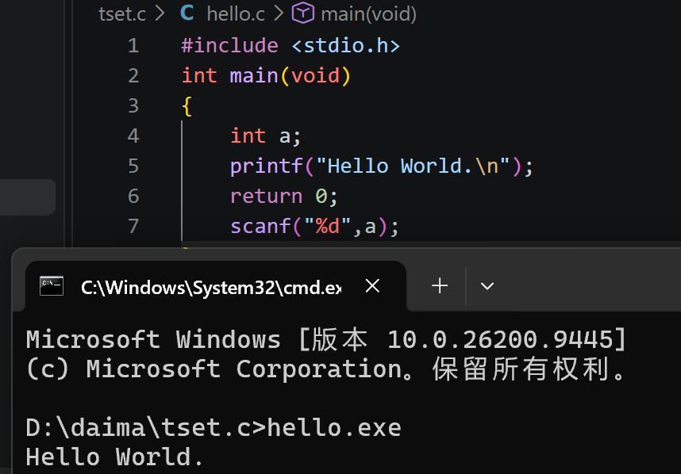
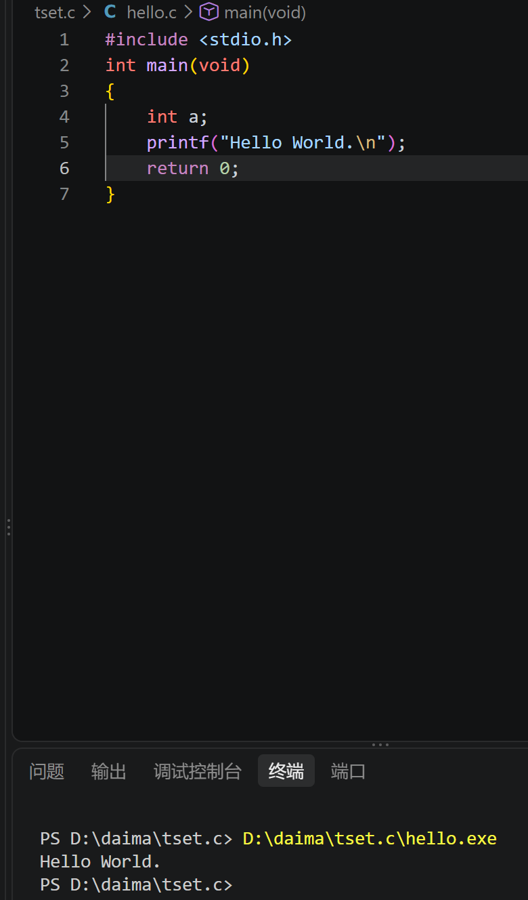
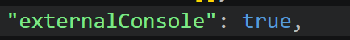

# part1
 1. 什么是GCC，什么是MinGW？它的作用是什么？
  gcc是编译器，将源代码转换成机器能识别运行的语言，会有预处理，编译，汇编，等步骤，最终生成可执行文件，即机器能读懂运行的文件。mingw可以理解是实现gcc在windows上运行的工具。gcc原生是在Linux下运行，mingw可以提供能在windows上运行的gcc，生成可执行文件，还能提供make,gdb等调试工具，简直是个移植工具包。
2. c_cpp_properties.json launch.json tasks.json这三个文件分别有什么作用？
 *  c_cpp_properties.json用来配置 C/C++ 扩展的 IntelliSense（智能感知），包括代码提示、自动补全、跳转定义、错误波浪线这些功能。它不参与实际的编译或调试，主要影响书写体验，以至于不用像在记事本上敲代码那样单一枯燥。
 * tasks.json最常见的用途就是编译代码。相当于自动实现 gcc hello.c -o hello.exe 这项命令的发布和执行。如果是在Linux环境下需要手动敲比较麻烦，当然也可以用Makefile帮助实现，而这个文件吧这些活自动做了，使得只需要按run就能实现编译，不用在命令行手动输入。
 * launch.json告诉 VS Code 的调试器该怎么启动你的程序、在哪里设断点、传什么参数，，用不用外部终端，就像是给调试器看的说明书，因为机器很笨，每一行代码给它发布指令，让它一步步按着这些指令去完成调试这个功能。
3. 为什么要在编辑器内下载C语言的插件，插件的作用又是什么？
编辑器负责工程师写代码，如常用的VS Code，但写好的代码不可能直接就能输出，需要编译器来转换为可执行文件，而插件便是这两者间的桥梁。C语言插件还可以实现代码亮色，使代码一目了然，提高书写体验。没有插件VS Code就相当于一个记事本，发挥不了运行代码的作用。
4.  
```json
   {
    // 使⽤ IntelliSense 了解相关属性。  
    // 悬停以查看现有属性的描述。  
    // 欲了解更多信息，请访问: https://go.microsoft.com/fwlink/?linkid=830387     "version": "0.2.0",
    "configurations": [
        {
            "name": "gcc.exe - ⽣成和调试活动⽂件",  // 该调试任务的名字，启动调试时会在待选列表中显⽰
            "type": "cppdbg",
            "request": "launch",
            "program": "${fileDirname}\\${fileBasenameNoExtension}.exe",            "args": [],
            "stopAtEntry": false,  //程序启动后不需要在 main 函数入口暂停，直接运行到第一个断点才停
            "cwd": "${workspaceFolder}",
            "environment": [],
            "externalConsole": true,  //无需外部窗口运行程序，使用 VS Code 内置的调试控制台。
            "MIMode": "gdb",
            "miDebuggerPath": "C:\\mingw64\\bin\\gdb.exe",  //调试器可执行文件的路径
            "setupCommands": [
                {
                    "description": "为 gdb 启⽤整⻬打印",
                    "text": "-enable-pretty-printing",
                    "ignoreFailures": true
                }
            ],
            "preLaunchTask": "C/C++: gcc.exe build active file"  // 调试前的预执⾏任务，这⾥的值是tasks.json⽂件中对应的编译任务，也就是调试前需要先编译
        }
    ]
}
```




* 我尝试打开外部终端（已设定externalConsole为true）但会被Winsows的智能应用控制拦截，因为Mingw相关文件没有得到微软的白名单，我又不想将其关闭，抱歉只能这样。
# part2
1. 变量类型： 什么是变量的类型？它为什么重要？如果你想存放你的年龄（比如 18），应该选择哪种基本变量类型（如整数、浮点数）？如果你想存放单词 “apple”，使用一个char类型的字符变量能实现吗？尝试编程验证你的想法，并思考正确的存储方式应该是什么？

变量类型是告诉计算机这个变量是什么类型，比如整数，浮点数，字符等。声明变量类型相当于告诉计算机这个变量是什么，要占多少内存，用何种方式解读（相同二进制不同数据类型解读方式不一样），怎么做运算。不同类型计算机解读方式不同，运算规则也不同。年龄用int（整数型）。不行，因为char本质是一字节整型，只能储存一个字符a，储存apple应该用数组，在这里用表示
一个数组（char m[6] = "apple"）（apple作为字符串结尾应该末尾有个\0，所以是6）,这样输出时才是这个字符串。

2. 数组的起始与边界： 数组的第一个元素下标通常是从 0 还是 1 开始？访问数组元素时，下标超出其有效范围（例如，长度为 5 的数组访问 arr[5] 或 arr[-1]）会导致什么问题？为什么数组越界是一个常见的、危险的错误？

通常是0开始;可能会读到垃圾值（存在内存中的其他数据），在写时也可能篡改了旁边变量的值，甚至严重导致程序崩溃;常见在于C不会检查下标，也不会给报错提示，程序员自己写时也容易出错（长度为5的数组最后编号是4）。危险在于可能直接导致程序崩溃，篡改了其它变量，产生难以排查的隐患和bug，自己调试时也不知道是哪里出了问题，耗费大量时间。

3. 流程控制 - 循环结构： 循环结构（如 for, while）是如何控制代码块重复执行的？请分别简述它们的基本结构。for 循环的初始化、条件判断和迭代部分各自的作用是什么？while 循环和 do…while 循环在首次执行条件判断上有何关键区别？尝试用两种不同的循环结构实现同一个任务（例如，计算 1 到 10 的和），体会它们的异同。

先进行条件判断，若为真则返回1，执行下一步，反正返回0，结束循环。执行完下一步再跳转到条件判断，如此循环往复实现代码重复执行;while就只有一个条件判断和循环体，for初始化是初始一个变量，条件判断就是判断这个变量满不满足这个条件（可以是算数运算或关系表达式来判断），迭代部分就是给这个变量在该循环结束后加上或减少一个值，然后再跳转到条件判断。（当然也可以是多个变量，用逗号隔开进行判断）;while循环首先会看条件判断是否满足，而do while会先执行一次循环体，下一次再进行条件判断决定是否执行;for循环就是将while循环变得简洁，缩短代码，将变量初始化，条件判断，更新放在了一起，异就在于整个结构是有较大差别的。同在于整个过程的本质流程是相同的。
4. 流程控制 - 逻辑表达式：在条件判断（如 if, else if）和循环条件中使用的逻辑表达式（如age > 18 && score >= 60）与算术表达式（如a + b * c）有何本质区别(尝试从运算对象和运算结果分析)？运算逻辑符&&,||,!的含义分别是什么？尝试编写包含多个条件的逻辑表达式并预测其输出结果。

从运算对象上逻辑表达式是判断这个过程，而算术表达式是个数字。运算结果上前者返回只有1（真）和0（假），而后者是运算结果，可以是任意数值；&&是和，即要同时满足，||是或，只要有一个满足即可，！是非的意思，！=即不等于。
例如 age > 18 && wage == 6000 || a !=12 age>18且wage==6000或a不等于12条件成立。
     

# part3
1. 主函数a,b的值并没有交换，原因在于swap函数中只是将a,b这两个实参的值传递给了形参a,b，相当于自己复制了一份值给它，而自身并没有发生改变，swap函数中ab发生了交换，但并不影响主函数中的值的改变。实参传递值给形参其实是个复制粘贴的过程，粘贴出去的就和原先的没关系了。
2. 要实现交换，就要传ab的地址，函数顺着地址找到真正的a,b，才能实现主函数ab值的改变。


  
  

