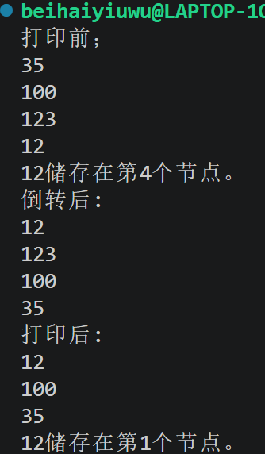

# STEP1
1. 如何在C语言中定义指针变量？指针变量的大小是固定的吗？其大小与什么有关？  
* 使用类型*指针名来进行定义，例如int *q，char *m等，定义只是声明了指针指向什么类型，给指针分配了内存，但它存的数据没有分配内存，所以要加上地址。
* 在同一系统中大小是固定的，32位系统中为4字节，64位系统中位8字节.
* 其大小与系统位数有关，具体来讲是地址总线的宽度有关，因为指针存的是地址，并不是数据，地址的大小与数据类型并没有关系。
2.   
```c
int main()
int x = 10;
int* p = &x;
*p = 20;

int arr[3] = {3, 6, 9};
int *q = arr;
int y = ++*arr  +  *++q;

printf("%d %d", x, y);    
```
输出；20 10  
* 首先定义p指向x的地址，然后解引p，并为其赋值，相当于直接在x的地址上改变了x的值，所以x=20。
* 定义指针q为数组arr，数组名是该数组首元素的地址，所以数组arr存的是第一个数字3的地址，相当于q指向3的地址，*++q意思是先将指针向后移动一个单位（一个元素的长度）即移动到6的位置再解引生成6。*arr是解引第一个元素（即3）的地址，然后加上1，即3+1=4，最终y=4+6=10。所以输出20 10；  
3. 什么是野指针？简述其危害。如何避免产生野指针？  
* 野指针就是指向不确定内存位置的指针，不知道指针存的是哪个位置。  
危害是可能读出来的是垃圾数字，给指针赋值时会改变原内存存的数据，导致很难排查，甚至改到系统运行的数据，程序直接崩溃。  
* 定义指针时一定要初始化，给它一个地址，否则就成了野指针。释放后要进行重置，用前要进行检查。  
# 结构体  
1. 
```c
typedef struct Perinfo{
  char name[10];
  char sex;
  int old;
  double height;

}inf;  
```
2. 了解并说明结构体指针的含义。  
* 顾名思义，结构体指针就是指向一个结构体的指针，声明方式为关键字struct+结构标记+*指针名，表示一个指向该结构的指针。假设该指针指向该类型gha,him为指针，则写为him=&gha,这样就指向了这个结构体。除此之外，指针还能指向结构体数组，方式与普通指针方式一样。打印时写为him->结构体中变量名，或(*him).变量名。总之用结构体访问其中元素效率更高，也能作为参数传给函数。  
3. 了解一下结构体的内存对齐规则，据此计算一下你刚刚定义的结构体占用字节的大小（可用sizeof运算符验证计算结果）。提交计算过程。(此外，你还可以尝试更改一下结构体中成员的定义顺序，看看对结构体占用字节数的影响)  
* 结构体内存对齐规则就是结构体中的每个变量位置的首位只能是该变量类型所占字节数的整数倍。例如，int是4字节，其位置只能是4的整数倍，如0，4，8，char是一字节，只要是整数都行。  
* 该结构体char型的数组占有0~9位置，sex占了第10位，int类型变量只能从12号位置开始，到15位置结束，double是八字节，从16位置开始，23号结。总共是占了0~23的位置，24字节长度，故打印出来是24，实际运算出来的也是24。其实这样做是为了提高计算机运行访问数据的速度，计算机读数据时一块一块读的，以4字节或8字节，这样使得读出来的数据不用再拼凑在一起，浪费了一些空间，节约一些时间。如果是以1或2个字节读的话读完后好要将读的（如int）拼凑在一起。  
* 更改顺序就完全不一样，由上述计算方式不难看出。  
# STEP2
1. 请对比链表和数组的存储，讲讲链表和数组的区别。  
* 链表是靠指针将一个个节点连接在一起，每个节点都包含指向下一个节点的指针，内存是靠malloc自动分配内存，所以链表地址是不连续的，读地址也必须顺着链表一个个往下读。  
* 数组是在声明时整个内存大小已经分配好了，一整块连续空间，元素按照下标依次存放在其中，一个挨着一个，访问直接靠下标。  
* 链表就像一列火车，节点是一节节车厢，里面存着各种数据类型。指针连接着各节车厢，地址是车厢编号，每节编号都不一样。数组就是互开房门的房间，地址就是门牌号，一个接着一个。  
2. 简述单向链表节点的结构特点。定义一个只存储一个整数的单向链表节点。
* 链表节点有该节点存的数据和指向下一个节点的指针构成，特殊的如头节点没有存储数据只有指针，尾节点指针指向NULL。  
```c
typedef struct NODE{
  struct NODE *link;
   int data;
}node;
```
3. 程序运行后的结果  

* 整套题目最开始便要求创建一个头节点，但我在书上看到有些是使用的头指针。头节点虽然多占用了一个空间，但换来了代码的简洁和方便。头插不用再改头指针，尾插也省去了多余的判断，所以多建个头节点有好处。
* 链表相对于数组其实更方便实现了数据的插入修改和查找，通过遍历的方式实现了各个节点的访问，便可在此基础上实现以上操作。
* 本道题的学习方式主要通过网上查阅，书籍，和AI使用，主要是配合相关图片，不然最开始看的时候根本看不懂。一个节点是如何指向另外一个节点的，怎么实现遍历的，看图画图是个很好的方式，节点就像一个盒子，盒子通过指针地址指向另外一个盒子，盒子的访问寻找全靠地址，从中我感受到了指针的巨大作用。

  


 

